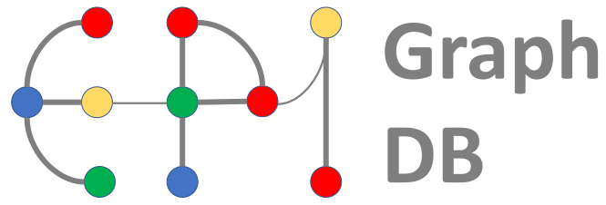
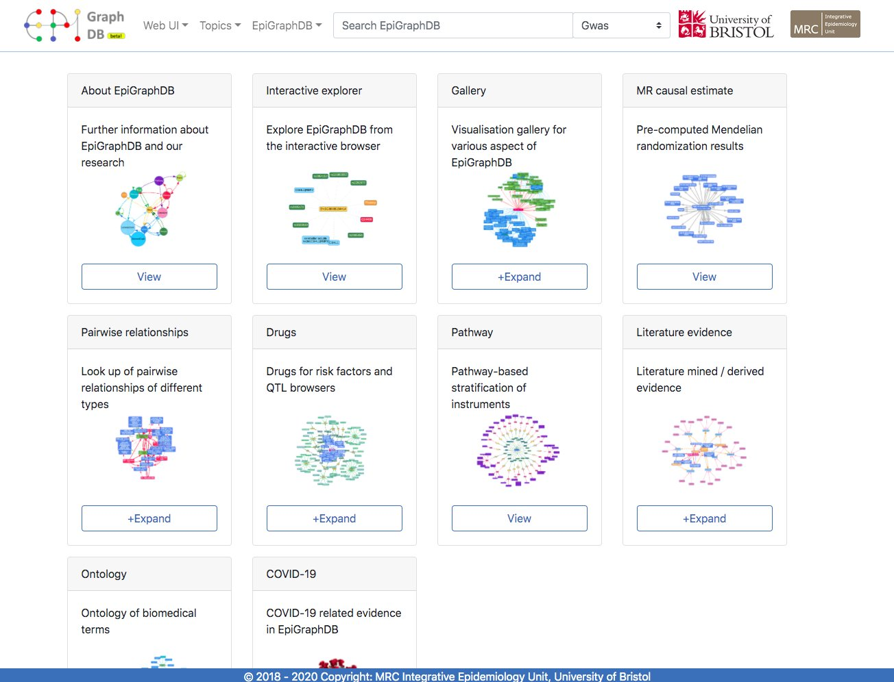
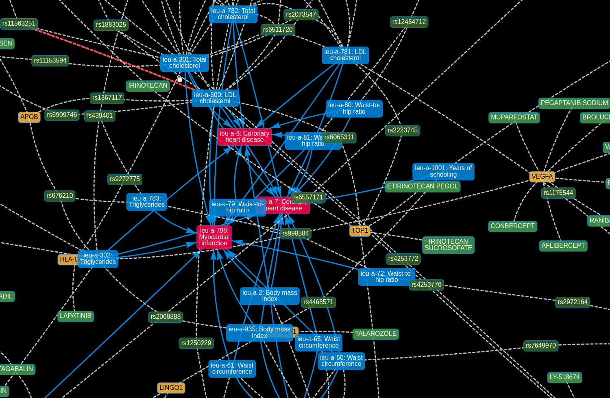

# EpiGraphDB: A database and data mining platform for health data science

<a href="https://epigraphdb.org" target="_blank"></a>
<a href="https://www.bristol.ac.uk" target="_blank"></a>
<a href="https://www.bristol.ac.uk/ieu" target="_blank"></a>

[](https://colab.research.google.com/github/MRCIEU/epigraphdb)
[](https://mybinder.org/v2/gh/MRCIEU/epigraphdb/master)

<a href="https://epigraphdb.org" target="_blank"></a>
<a href="https://docs.epigraphdb.org" target="_blank"></a>

[EpiGraphDB](https://epigraphdb.org)
is an analytical platform and database to support data mining in epidemiology.
The platform incorporates a graph of causal estimates generated by systematically applying Mendelian randomization to a wide array of phenotypes, and augments this with a wealth of additional data from other bioinformatic sources.
EpiGraphDB aims to support appropriate application and interpretation of causal inference in systematic automated analyses of many phenotypes.

This repository contains example use cases to demonstrate the functionalities of EpiGraphDB,
via the API using Jupyter notebooks in Python.
The following table lists the main components of EpiGraphDB and their sources.

<table class="table">
  <thead>
    <tr class="header">
      <th>EpiGraphDB Component</th>
      <th>Source</th>
    </tr>
  </thead>
  <tbody>
    <tr>
      <td><a href="#">Data integration pipeline</a></td>
      <td><a href="https://github.com/MRCIEU/epigraphdb-graph" target="_blank">Github</a></td>
    </tr>
    <tr>
      <td><a href="https://epigraphdb.org" target="_blank">Web UI</a></td>
      <td><a href="https://github.com/MRCIEU/epigraphdb_web" target="_blank">Github</a></td>
    </tr>
    <tr>
      <td><a href="https://api.epigraphdb.org" target="_blank">API</a></td>
      <td><a href="https://github.com/MRCIEU/epigraphdb_api" target="_blank">Github</a></td>
    </tr>
    <tr>
      <td><a href="https://mrcieu.github.io/epigraphdb-r" target="_blank">R package</a></td>
      <td><a href="https://github.com/MRCIEU/epigraphdb-r" target="_blank">Github</a></td>
    </tr>
    <tr>
      <td><a href="https://github.com/MRCIEU/epigraphdb">Example use cases (this repo)</a></td>
      <td><a href="https://github.com/MRCIEU/epigraphdb">Github (this repo)</a></td>
    </tr>
  </tbody>
</table>
*We will gradually open source our components in the future months.

## Example use cases

Below are the example use case notebooks.
You can either use
[Google Colab](https://colab.research.google.com/github/MRCIEU/epigraphdb) or
[Binder](https://mybinder.org/v2/gh/MRCIEU/epigraphdb/master)
to play with these notebooks online, or clone the repo and [set up](#set-up) a local Jupyter lab environment.

<table class="table">
  <tbody>
    <tr>
      <td>
      <strong><a href="paper-case-studies" target="_blank">Case studies for the EpiGraphDB paper</a></strong>
      </td>
      <td></td>
      <td></td>
    </tr>
    <tr>
      <td><a href="paper-case-studies/case-1-pleiotropy.ipynb" target="_blank">
        Case study 1: Distinguishing vertical and horizontal pleiotropy for SNP-protein associations
      </a></td>
      <td>
      <a href="https://colab.research.google.com/github/MRCIEU/epigraphdb/blob/master/paper-case-studies/case-1-pleiotropy.ipynb" target="_blank_"> </a>
      </td>
      <td>
      <a href="https://mybinder.org/v2/gh/MRCIEU/epigraphdb/master?filepath=paper-case-studies%2Fcase-1-pleiotropy.ipynb" target="_blank_"> </a>
      </td>
    </tr>
    <tr>
      <td><a href="paper-case-studies/case-2-alt-drug-target.ipynb" target="_blank">
        Case study 2: Identification of potential drug targets
      </a></td>
      <td>
      <a href="https://colab.research.google.com/github/MRCIEU/epigraphdb/blob/master/paper-case-studies/case-2-alt-drug-target.ipynb" target="_blank_"> </a>
      </td>
      <td>
      <a href="https://mybinder.org/v2/gh/MRCIEU/epigraphdb/master?filepath=paper-case-studies%2Fcase-2-alt-drug-target.ipynb" target="_blank_"> </a>
      </td>
    </tr>
    <tr>
      <td><a href="paper-case-studies/case-3-literature-triangulation.ipynb" target="_blank">
        Case study 3: Triangulating causal estimates with literature evidence
      </a></td>
      <td>
      <a href="https://colab.research.google.com/github/MRCIEU/epigraphdb/blob/master/paper-case-studies/case-3-literature-triangulation.ipynb" target="_blank_"> </a>
      </td>
      <td>
      <a href="https://mybinder.org/v2/gh/MRCIEU/epigraphdb/master?filepath=paper-case-studies%2Fcase-3-literature-triangulation.ipynb" target="_blank_"> </a>
      </td>
    </tr>
    <tr>
      <td>
      <strong><a href="general-examples" target="_blank">General examples</a></strong>
      </td>
      <td>
      </td>
    </tr>
    <tr>
      <td><a href="general-examples/getting-started-with-epigraphdb.ipynb" target="_blank">
      Getting started with EpiGraphDB in Python
      </a></td>
      <td>
      <a href="https://colab.research.google.com/github/MRCIEU/epigraphdb/blob/master/general-examples/getting-started-with-epigraphdb.ipynb" target="_blank_"> </a>
      </td>
      <td>
      <a href="https://mybinder.org/v2/gh/MRCIEU/epigraphdb/master?filepath=general-examples%2Fgetting-started-with-epigraphdb.ipynb" target="_blank_"> </a>
      </td>
    </tr>
    <tr>
      <td><a href="general-examples/platform-meta-functionalities.ipynb" target="_blank">
        Functionalities in getting metadata, entity search, and using Cypher queires
      </a></td>
      <td>
      <a href="https://colab.research.google.com/github/MRCIEU/epigraphdb/blob/master/general-examples/platform-meta-functionalities.ipynb" target="_blank_"> </a>
      </td>
      <td>
      <a href="https://mybinder.org/v2/gh/MRCIEU/epigraphdb/master?filepath=general-examples%2Fplatform-meta-functionalities.ipynb" target="_blank_"> </a>
      </td>
    </tr>
  </tbody>
</table>

The example notebooks above are done in Python using the EpiGraphDB API.
R users can visit the
[package vignettes](https://mrcieu.github.io/epigraphdb-r/#using-epigraphdb)
for equivalent functionalities using the `epigraphdb` R package.

### Set up

We provide a
[conda](https://docs.conda.io/projects/conda/en/latest/user-guide/tasks/manage-environments.html)
environment
[configuration file](environment.yml)
for readers to run the notebooks locally.

To do this first you will need to install
[conda](https://docs.conda.io/projects/conda/en/latest/user-guide/install/index.html).
Then follow the steps below to set up the conda environment.

```shell
# Bootstrap the environment
conda env create -f environment.yml

# Activate the environment in your shell session.
conda activate epigraphdb-notebooks

# Open Jupyter lab and you should be able to run the code examples!
jupyter lab
```

## Citation

Please cite EpiGraphDB as

> Yi Liu, Benjamin Elsworth, Pau Erola, Valeriia Haberland, Gibran Hemani, Matt Lyon, Jie Zheng, Oliver Lloyd, Marina Vabistsevits, Tom R Gaunt, EpiGraphDB: a database and data mining platform for health data science, Bioinformatics, btaa961, https://doi.org/10.1093/bioinformatics/btaa961

```
@article{epigraphdb2020bioinformatics,
    author = {Liu, Yi and Elsworth, Benjamin and Erola, Pau and Haberland, Valeriia and Hemani, Gibran and Lyon, Matt and Zheng, Jie and Lloyd, Oliver and Vabistsevits, Marina and Gaunt, Tom R},
    title = {{EpiGraphDB}: a database and data mining platform for health data science},
    journal = {Bioinformatics},
    year = {2020},
    month = {11},
    issn = {1367-4803},
    doi = {10.1093/bioinformatics/btaa961},
    url = {https://doi.org/10.1093/bioinformatics/btaa961},
    note = {btaa961},
    eprint = {https://academic.oup.com/bioinformatics/advance-article-pdf/doi/10.1093/bioinformatics/btaa961/34178613/btaa961.pdf}
}
```

## Contact

Please get in touch with us for issues, comments, suggestions, etc. via the following methods:

- [The issue tracker on the repo](https://github.com/MRCIEU/epigraphdb/issues)
- [The support email](mailto:feedback@epigraphdb.org)
- [The EpiGraphDB twitter](https://twitter.com/epigraphdb)
